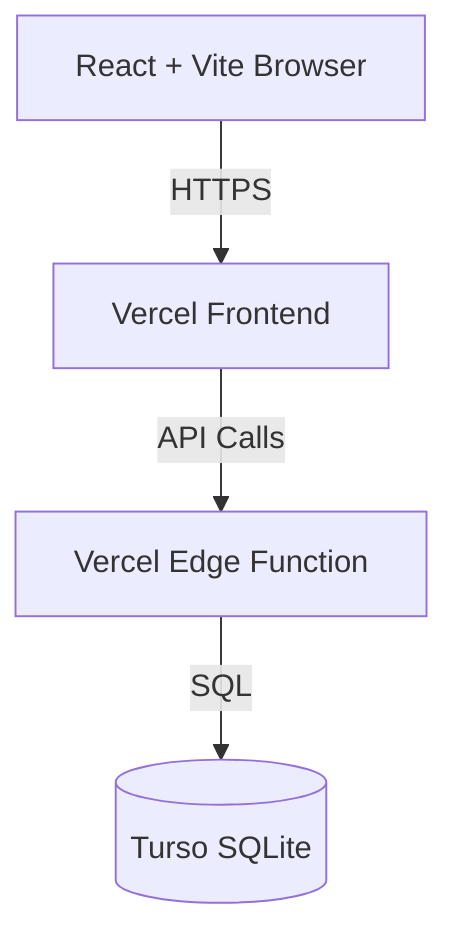

# Smart Agriculture Monitoring Dashboard

**[Status: Production Ready]** 🟢 — Full-stack application with Vercel Edge backend and React frontend.

A real-time smart agriculture monitoring system deployed on Vercel Edge (frontend + backend) with zero paid subscriptions.

---

## What This Is

A full-stack agriculture monitoring dashboard with:
- **Frontend**: React 19 + TypeScript + Vite 8 + Tailwind CSS v4, deployed on Vercel
- **Backend**: Vercel Edge Functions (edge runtime) with Turso SQLite database
- **Database**: Turso (free tier: 1GB storage, 1B reads/month)
- **Cost**: $0/month (Vercel free tier + Turso free tier)

---

## Architecture



| Layer | Technology | Notes |
|-------|-----------|-------|
| Frontend | React 19 + Vite 8 + Tailwind CSS v4 | TypeScript, Recharts, Lucide icons |
| Backend | Vercel Edge Functions | Edge runtime, CORS enabled |
| Database | Turso (SQLite-compatible) | Free tier: 1GB, 1B reads/month |
| Hosting | Vercel | Frontend + backend on edge network |
| Testing | Vitest + React Testing Library | Backend + frontend tests |

---

## Project Structure

```
project-root/
├── frontend/
│   ├── src/
│   │   ├── components/        # Layout, shared UI
│   │   ├── pages/             # 8 route pages (Dashboard, Soil, Weather, etc.)
│   │   ├── lib/               # API client, utilities
│   │   ├── data/              # TypeScript interfaces, mock data
│   │   ├── test/              # Test setup
│   │   ├── App.tsx            # Router
│   │   ├── main.tsx           # Entry point
│   │   └── index.css          # Tailwind + custom classes
│   ├── index.html
│   ├── package.json
│   ├── vite.config.ts
│   ├── tsconfig.json
│   ├── vercel.json
│   ├── .env.example
│   └── .env                   # Local env (not committed)
│
├── backend/
│   ├── api/
│   │   └── index.ts           # Vercel Edge Function (catch-all)
│   ├── package.json
│   ├── tsconfig.json
│   ├── vercel.json
│   ├── .env.example
│   └── .env                   # Local env (not committed)
│
├── docs/
│   ├── REQUIREMENTS.md        # FR/NFR specification
│   ├── ARCHITECTURE.md        # System design, data flow, scalability
│   ├── AI_PROMPTS.md          # AI-assisted development log
│   ├── SYLLABUS_MAPPING.md    # Cloud strategy syllabus alignment
│   └── CLOUDFLARE_SETUP.md    # Deployment guide
│
├── .github/
│   └── workflows/
│       ├── deploy.yml         # Combined CI/CD pipeline
│       ├── frontend.yml       # Frontend-only deploy
│       └── backend.yml        # Backend-only deploy
│
├── package.json               # Root monorepo
├── .gitignore
└── README.md
```

---

## Local Setup

### Prerequisites

- Node.js 20+ (`node -v`)
- npm (`npm -v`)

### Installation

```bash
# Install all dependencies
npm install
```

### Development

Start both frontend and backend concurrently:

```bash
npm run dev
```

Or run separately:

```bash
# Terminal 1: Backend (Vercel Edge local dev)
npm run dev:backend

# Terminal 2: Frontend (Vite dev server)
npm run dev:frontend
```

### Environment Variables

**Frontend** (`frontend/.env`):
```env
VITE_API_URL=http://localhost:3001/api
```

**Backend** (`backend/.env`):
```env
DATABASE_URL=file:./dev.db
DATABASE_AUTH_TOKEN=
```

### Build

```bash
npm run build
```

---

## API Endpoints

| Method | Endpoint | Description |
|--------|----------|-------------|
| GET | `/api/health` | Health check |
| GET | `/api/devices` | List all field devices |
| GET | `/api/crop-zones` | List all crop zones |
| GET | `/api/alerts` | List all alerts |
| GET | `/api/irrigation-schedules` | List irrigation schedules |
| GET | `/api/sensor-readings` | Get sensor readings with filters |
| POST | `/api/sensor-readings` | Create single sensor reading |
| POST | `/api/sensor-readings/batch` | Batch insert sensor readings |
| PATCH | `/api/devices/:id` | Update device |
| PATCH | `/api/alerts/:id` | Acknowledge alert |
| PATCH | `/api/irrigation-schedules/:id` | Update schedule status |
| GET | `/api/analytics/soil-moisture` | Soil moisture analytics |
| GET | `/api/analytics/temperature` | Temperature analytics |
| GET | `/api/analytics/ph` | pH analytics |

---

## Database

### Local Development

Uses SQLite file (`backend/dev.db`) via `@libsql/client`:

```bash
# Set DATABASE_URL=file:./dev.db in backend/.env
```

### Production (Turso)

1. Sign up at [turso.xyz](https://turso.xyz)
2. Create a database: `turso db create smart-agri-db`
3. Get connection string: `turso db show smart-agri-db --url`
4. Get auth token: `turso db tokens create smart-agri-db`
5. Add to Vercel environment variables:
   - `DATABASE_URL` = `libsql://your-db.turso.io`
   - `DATABASE_AUTH_TOKEN` = your token

---

## CI/CD Deployment (GitHub Actions)

This project uses GitHub Actions to automatically deploy to Vercel on every push to `main`.

### Prerequisites

1. **Vercel Account**: Sign up at [vercel.com](https://vercel.com)
2. **Turso Account** (optional, for production DB): Sign up at [turso.xyz](https://turso.xyz)
3. **GitHub Repository**: Push this code to GitHub

### Step 1: Create Vercel Projects

1. Create **Frontend Project** on Vercel:
   - Import `frontend/` directory
   - Framework: Vite
   - Build Command: `npm run build`
   - Output: `dist`

2. Create **Backend Project** on Vercel:
   - Import `backend/` directory
   - Framework: Other
   - Build Command: `npm run build`
   - Output: `.vercel/output`

### Step 2: Get Vercel Tokens

1. Go to [Vercel → Settings → Tokens](https://vercel.com/account/tokens)
2. Create token with full account access
3. Note your **Org ID** from Vercel dashboard

### Step 3: Add GitHub Secrets

Go to **GitHub → Settings → Secrets and variables → Actions** and add:

| Secret | Value | Where to find |
|--------|-------|---------------|
| `VERCEL_ORG_ID` | Your Vercel Org ID | Vercel dashboard |
| `VERCEL_FRONTEND_TOKEN` | Vercel token | Vercel → Settings → Tokens |
| `VERCEL_FRONTEND_PROJECT_ID` | Frontend project ID | Vercel project settings |
| `VERCEL_BACKEND_TOKEN` | Vercel token (same as above) | Vercel → Settings → Tokens |
| `VERCEL_BACKEND_PROJECT_ID` | Backend project ID | Vercel project settings |
| `VITE_API_URL` | Backend Vercel URL | e.g., `https://smart-agri-backend.vercel.app/api` |
| `DATABASE_URL` | Turso DB URL | `turso db show --url` |
| `DATABASE_AUTH_TOKEN` | Turso auth token | `turso db tokens create` |

### Step 4: Enable GitHub Actions

Push code to `main` branch. The workflow will:
1. Build backend (Vercel Edge)
2. Deploy backend to Vercel
3. Build frontend with production API URL
4. Deploy frontend to Vercel

---

## Testing

```bash
# Run all tests
npm test

# Run frontend tests only
npm run test --workspace=frontend

# Run backend tests only
npm run test --workspace=backend
```

---

## Tech Stack

| Component | Technology |
|-----------|-----------|
| Frontend | React 19, TypeScript, Vite 8, Tailwind CSS v4 |
| Charts | Recharts |
| Icons | Lucide React |
| Backend | Vercel Edge Functions (TypeScript) |
| Database | Turso (SQLite-compatible) |
| Testing | Vitest, React Testing Library |
| CI/CD | GitHub Actions → Vercel |

---

## License

MIT — Built for educational purposes.
