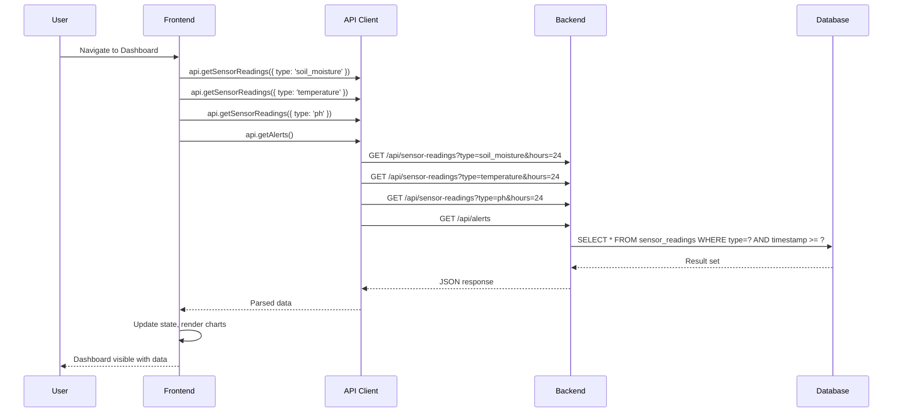
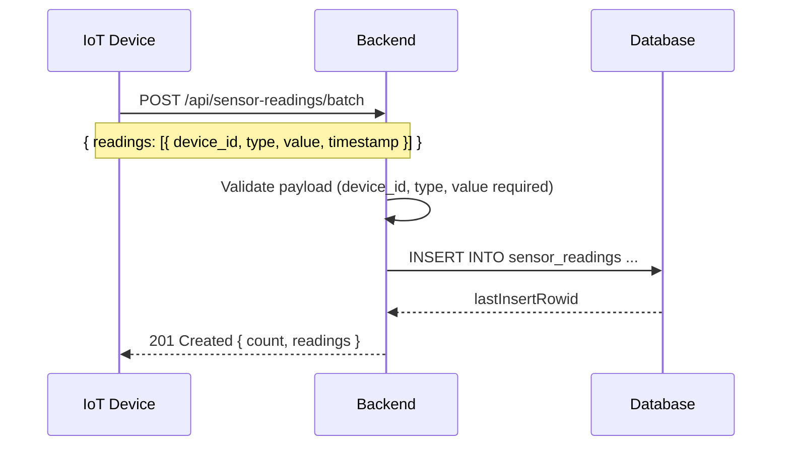

# System Architecture

## 1. High-Level Architecture

```
┌─────────────────────────────────────────────────────────────────┐
│                         Presentation Layer                       │
│  ┌───────────────────────────────────────────────────────────┐  │
│  │              React 19 + TypeScript + Vite 8              │  │
│  │  ┌─────────┐ ┌─────────┐ ┌─────────┐ ┌─────────┐        │  │
│  │  │Dashboard│ │Soil Mon.│ │Weather  │ │Irrigation│       │  │
│  │  └─────────┘ └─────────┘ └─────────┘ └─────────┘        │  │
│  │  ┌─────────┐ ┌─────────┐ ┌─────────┐ ┌─────────┐        │  │
│  │  │Crop Health│ │ Alerts │ │ Devices │ │Settings │        │  │
│  │  └─────────┘ └─────────┘ └─────────┘ └─────────┘        │  │
│  │                                                           │  │
│  │  Components: Layout, StatCard, Charts, Tables, Forms      │  │
│  │  State: React hooks (useState, useEffect)                 │  │
│  │  Styling: Tailwind CSS v4 + custom @layer components      │  │
│  └───────────────────────────────────────────────────────────┘  │
└─────────────────────────────────────────────────────────────────┘
                            │
                            │ HTTP/REST (fetch)
                            ▼
┌─────────────────────────────────────────────────────────────────┐
│                         Application Layer                       │
│  ┌───────────────────────────────────────────────────────────┐  │
│  │                  Express 5 + Node.js                      │  │
│  │                                                           │  │
│  │  Routes:                                                   │  │
│  │  • GET    /api/devices                                     │  │
│  │  • GET    /api/crop-zones                                  │  │
│  │  • GET    /api/alerts                                      │  │
│  │  • GET    /api/irrigation-schedules                        │  │
│  │  • GET    /api/sensor-readings                             │  │
│  │  • GET    /api/analytics/soil-moisture                     │  │
│  │  • GET    /api/analytics/temperature                       │  │
│  │  • GET    /api/analytics/ph                                │  │
│  │  • POST   /api/sensor-readings                             │  │
│  │  • POST   /api/sensor-readings/batch                       │  │
│  │  • PATCH  /api/devices/:id                                 │  │
│  │  • PATCH  /api/alerts/:id                                  │  │
│  │  • PATCH  /api/irrigation-schedules/:id                    │  │
│  │  • GET    /api/health                                      │  │
│  └───────────────────────────────────────────────────────────┘  │
└─────────────────────────────────────────────────────────────────┘
                            │
                            │ Parameterized SQL
                            ▼
┌─────────────────────────────────────────────────────────────────┐
│                         Data Layer                              │
│  ┌───────────────────────────────────────────────────────────┐  │
│  │                    SQLite (better-sqlite3)                │  │
│  │                                                           │  │
│  │  Tables:                                                   │  │
│  │  • devices            (id, name, type, status, ...)       │  │
│  │  • crop_zones         (id, name, crop_type, health, ...)  │  │
│  │  • alerts             (id, type, message, source, ...)    │  │
│  │  • irrigation_schedules (id, zone_id, start_time, ...)    │  │
│  │  • sensor_readings    (id, device_id, type, value, ...)   │  │
│  │                                                           │  │
│  │  Indexes:                                                  │  │
│  │  • idx_sensor_device_type (device_id, type)               │  │
│  │  • idx_sensor_timestamp (timestamp)                        │  │
│  └───────────────────────────────────────────────────────────┘  │
└─────────────────────────────────────────────────────────────────┘
```

## 2. Data Flow Diagrams

### Dashboard Load Flow



### Sensor Data Ingestion Flow



## 3. Deployment Architecture

### Local Development
```
Browser (localhost:5173) ──proxy──► Express (localhost:3001) ──► SQLite file
```

### Production (Recommended)
```
Browser ──HTTPS──► Vercel (Frontend) ──HTTPS──► Cloudflare Workers (Backend) ──► D1 Database
```

### Alternative: AWS SAM (Future)
```
Browser ──HTTPS──► CloudFront ──► S3 (Frontend)
                           ──► API Gateway ──► Lambda ──► DynamoDB
```

## 4. Security Architecture

| Layer | Measure | Implementation |
|-------|---------|----------------|
| Frontend | CORS | Express `cors()` middleware with origin whitelist (production) |
| Backend | Input Validation | Required field checks on POST/PATCH endpoints |
| Backend | SQL Injection Prevention | Parameterized queries via `better-sqlite3` |
| Network | HTTPS | Enforced by hosting platform (Vercel/Cloudflare) |
| Data | No Secrets in Client | API keys and DB credentials server-side only |

## 5. Scalability Considerations

### Current Bottleneck
- SQLite file-based DB: suitable for single-server deployments
- No connection pooling needed (SQLite is file-based)
- Express single-threaded: adequate for <1000 req/s

### Scaling Path
1. **Workers**: Cloudflare Workers auto-scale globally with no configuration needed
2. **Horizontal**: Migrate to PostgreSQL with connection pooling (PgBouncer) if needed
3. **Caching**: Add Cloudflare KV or Redis for frequent analytics queries
4. **CDN**: Vercel Edge Network + Cloudflare CDN for frontend assets
5. **Queue**: Add message queue (BullMQ) for batch sensor ingestion

## 6. Technology Decisions

| Decision | Rationale | Alternatives Considered |
|----------|-----------|------------------------|
| React 19 | Latest stable, concurrent features, large ecosystem | Vue 3, Svelte |
| TypeScript | Type safety, better DX, catches errors at compile time | JavaScript with JSDoc |
| Vite 8 | Fast HMR, native ESM, excellent TS support | Webpack, Turbopack |
| Tailwind CSS v4 | JIT compiler, smaller bundle, native CSS nesting | Bootstrap, styled-components |
| Express 5 | Minimal, flexible, massive middleware ecosystem | Fastify, Hono |
| SQLite | Zero-config, single file, perfect for demos/small deployments | PostgreSQL, MySQL |
| Recharts | React-native, composable, good TypeScript support | Chart.js, D3.js |
